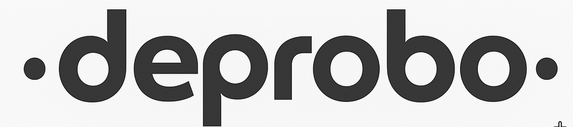
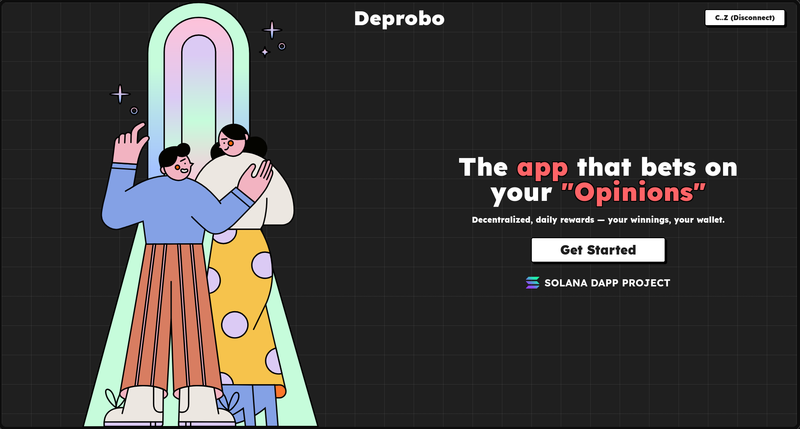

# 🔥Deprobo

<div align="center">



### **The app that bets on your "Opinions"**

_Decentralized, daily rewards — your winnings, your wallet._

[](https://opensource.org/licenses/MIT)
[](https://nextjs.org/)
[](https://solana.com/)
[](https://www.typescriptlang.org/)

[🚀 **Live Demo**](https://deprobo.client.vercel.app) • [📖 **Docs**](https://docs.deprobo.com) • [💬 **Discord**](https://discord.gg/deprobo)

</div>

---



## 🌟 What is Deprobo?

**Deprobo** is a decentralized prediction market built on Solana where users can predict outcomes with **YES/NO positions** and win **SOL tokens**. Think of it as a gamified way to put your opinions to the test while earning rewards for being right!

### ✨ Key Features

- 🎲 **Binary Predictions** - Simple Yes/No betting on real-world events
- 💰 **SOL Rewards** - Win SOL tokens for correct predictions
- 🎁 **Daily Rewards** - Earn consistent rewards for active participation
- ⚡ **Lightning Fast** - Built on Solana for instant, low-cost transactions
- 🔄 **Real-time Updates** - Live prediction tracking and instant results
- 🎨 **Beautiful UI** - Clean, intuitive design inspired by modern platforms

---

## 🛠️ Tech Stack

<table>
<tr>
<td align="center"><strong>Frontend</strong></td>
<td align="center"><strong>Backend</strong></td>
<td align="center"><strong>Blockchain</strong></td>
<td align="center"><strong>Database</strong></td>
</tr>
<tr>
<td align="center">
  <br/>
  <br/>
  
</td>
<td align="center">
  <br/>
  
</td>
<td align="center">
  <br/>
  <br/>
  
</td>
<td align="center">
  <br/>
  <br/>
  
</td>
</tr>
</table>

---

## 🚀 Quick Start

### Prerequisites

Make sure you have these installed:

- **Node.js** 18+
- **pnpm**
- A **Solana wallet** (Phantom, Solflare, etc.)

### ⚡ Installation

```bash
# 1️⃣ Clone the repository
git https://github.com/SimplyRohit/deprobo-client/tree/main
cd deprobo-client

# 2️⃣ Install dependencies
pnpm install

# 3️⃣ Copy environment variables
cp .env.example .env

# 4️⃣ Setup database
pnpm db:gen
pnpm db:mig
pnpm db:studio


# 6️⃣ Start development server
pnpm dlx inngest-cli@latest dev
pnpm dev
```

🎉 **That's it!** Visit `http://localhost:3000` to see your app running.

---

## ⚙️ Environment Variables

Create a `.env` file with these variables:

```bash
# 🗄️ Database
DATABASE_URL="your_neon_db_connection_string"

# ⛓️ Solana
NEXT_PUBLIC_SOLANA_NETWORK="devnet"
NEXT_PUBLIC_RPC_ENDPOINT="your_rpc_endpoint"
ANCHOR_WALLET="path_to_your_wallet"

# 🔄 Inngest
INNGEST_EVENT_KEY="your_inngest_key"
INNGEST_SIGNING_KEY="your_signing_key"

# 🔐 Auth
NEXTAUTH_SECRET="your_nextauth_secret"
NEXTAUTH_URL="http://localhost:3000"

```

## 🤝 Contributing

We love contributions! Here's how you can help:

1. **🍴 Fork** the repository
2. **🌿 Create** your feature branch (`git checkout -b feature/amazing-feature`)
3. **💾 Commit** your changes (`git commit -m 'Add amazing feature'`)
4. **🚀 Push** to the branch (`git push origin feature/amazing-feature`)
5. **📝 Open** a Pull Request

## 📄 License

This project is licensed under the **MIT License** - see the [LICENSE](LICENSE) file for details.

---

</div>
